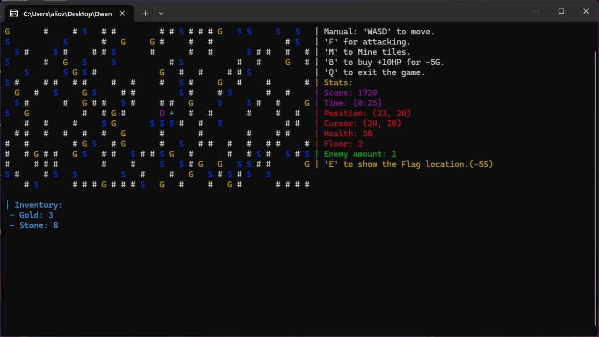

# Dwarven Depths

A lightweight console-based dungeon crawler built in C++.

## Features
- Explore procedurally generated floors.
- Collect resources like gold and stone.
- Battle enemies while navigating the dungeon.

## How to Play
1. **Movement:** Use arrow keys or WASD to move.
2. **Interaction:** Collect resources and avoid enemies.
3. **Floor Change:** Move to stairs to ascend floors.



## Contributions
Contributions are welcome! Submit issues or pull requests for improvements.

## Installation
1. Clone the repository:
   ```bash
   git clone https://github.com/aliozertekin/Dwarven-Depths.git
2. Build and run the game:
   ```bash
    g++ -std=c++17 -o game Main.cpp -pthread
    ./game

## Build Instructions with CMake

### Prerequisites
Make sure you have the following installed:
- **CMake** (https://cmake.org/)
- A **C++17-compatible compiler**

---

### Clone the Repository
```bash
git clone https://github.com/aliozertekin/Dwarven-Depths.git
cd Dwarven-Depths
mkdir build
cd build
cmake ..
```

### On linux/mac, use:
```bash
make
```
### On Windows, use:
```bash
cmake --build . --config Release
```
### Run the Game:
### Linux/Mac:
```bash
./DwarvenDepths
```
### Windows:
```bash
DwarvenDepths.exe
```
